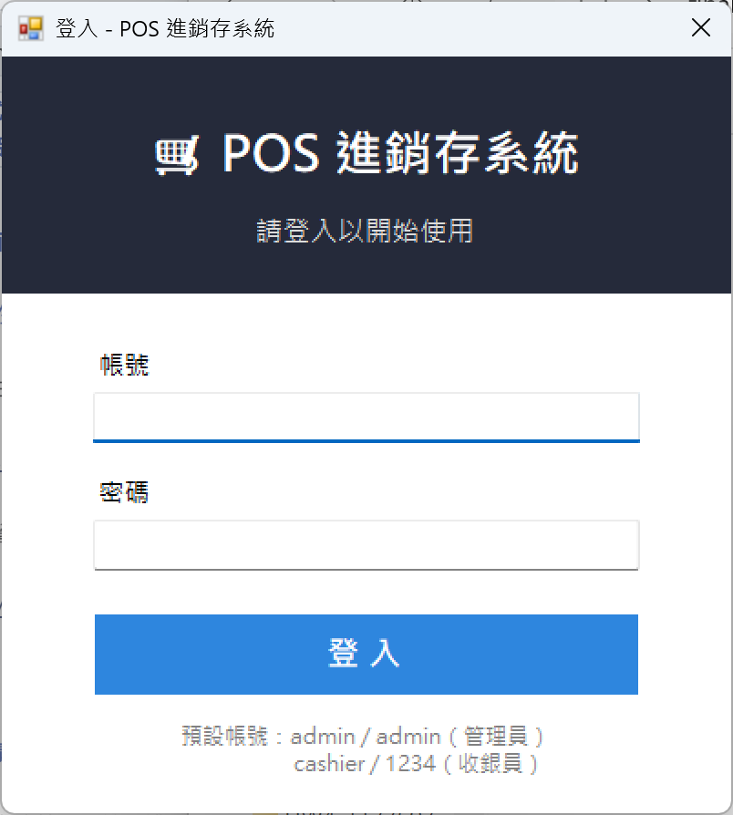
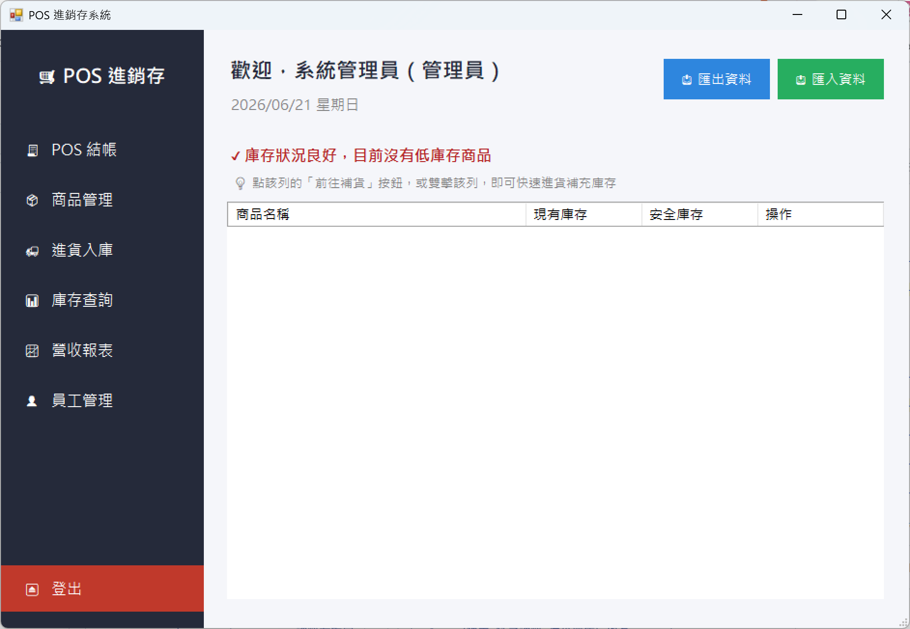
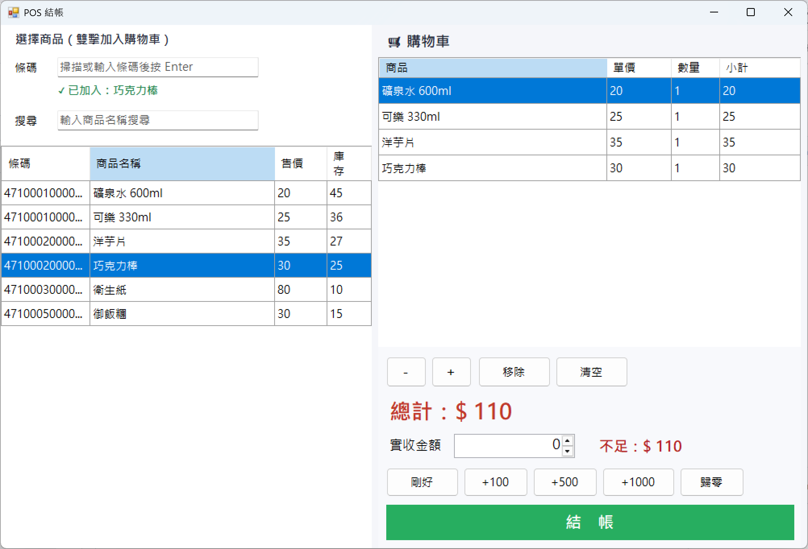
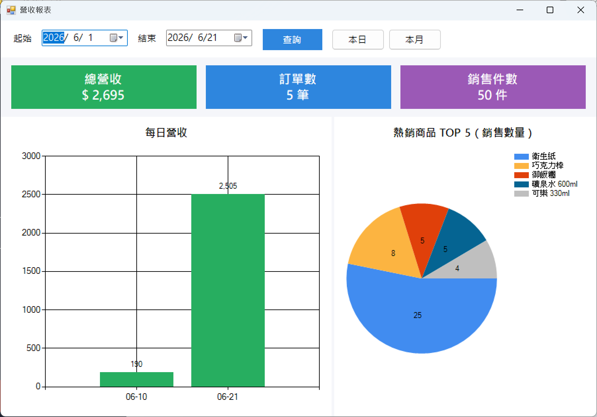

# 🛒 PosSystem — POS 進銷存系統

> 視窗程式設計 (II) 期末專題
> Visual Studio 2022 · C# · Windows Forms · .NET Framework 4.7.2 · SQLite

一套適用於小型商店 / 超商的 **POS 進銷存系統**，整合銷售結帳、進貨庫存、營收報表與帳號權限管理。
所有資料透過 **SQLite 資料庫**永久儲存，並支援**資料匯出 / 匯入**，可在不同電腦間搬移使用。

---

## ✨ 功能特色

| 模組 | 說明 |
|------|------|
| 🔐 **登入 / 權限管理** | 帳號密碼登入（密碼以 SHA256 雜湊儲存），分為**管理員**與**收銀員**兩種角色，依角色顯示不同功能 |
| 🧾 **POS 結帳** | 雙擊、條碼輸入或掃描槍加入購物車；**快捷收款按鈕**（剛好／+100／+500／+1000／歸零）；即時計算總計與找零；結帳採**資料庫交易**，同時寫入銷售單、明細並自動扣減庫存 |
| 📦 **商品管理** | 商品的新增 / 修改 / 刪除、分類、定價、條碼、安全庫存設定；支援關鍵字搜尋 |
| 🚚 **進貨入庫** | 建立進貨清單，確認後一次寫入進貨單並增加庫存 |
| 📊 **庫存查詢** | 即時檢視所有商品庫存，低於安全庫存自動以**紅字警示** |
| ⚡ **低庫存一鍵補貨** | 主畫面低庫存清單可直接點「前往補貨」或雙擊，自動跳轉進貨頁並選好該商品 |
| 📈 **營收報表** | 依日期區間統計總營收、訂單數、銷售件數，並以**長條圖**（每日營收）與**圓餅圖**（熱銷 TOP5）視覺化呈現 |
| 👤 **員工管理** | 員工帳號的新增 / 修改 / 刪除與密碼變更（僅管理員） |
| 💾 **資料匯出 / 匯入** | 將資料庫備份成檔案，可帶到其他電腦匯入還原；匯入時驗證檔案有效性 |

---

## 🖥️ 系統需求

- Windows 10 / 11
- Visual Studio 2022
- .NET Framework 4.7.2
- NuGet 套件：`System.Data.SQLite.Core`（首次建置時自動還原）

---

## 🚀 執行方式

1. 以 Visual Studio 2022 開啟 `PosSystem.sln`。
2. 第一次開啟時，VS 會自動還原 NuGet 套件（若未自動還原，請於「方案」按右鍵 →「還原 NuGet 套件」）。
3. 按 **F5** 執行。程式會在執行檔目錄自動建立 `pos.db` 並寫入範例資料。
4. 使用下方預設帳號登入即可開始操作。

### 🔑 預設帳號

| 角色 | 帳號 | 密碼 | 可用功能 |
|------|------|------|----------|
| 管理員 | `admin` | `admin` | 全部功能 |
| 收銀員 | `cashier` | `1234` | 收銀結帳、庫存查詢 |

### 🏷️ 範例商品條碼（可用於 POS 條碼輸入測試）

| 條碼 | 商品 |
|------|------|
| `4710001000017` | 礦泉水 600ml |
| `4710001000024` | 可樂 330ml |
| `4710002000018` | 洋芋片 |
| `4710002000025` | 巧克力棒（預設低庫存範例） |
| `4710003000019` | 衛生紙 |
| `4710005000011` | 御飯糰 |

---

## 📸 操作畫面

> 以下截圖請放在 `docs/` 資料夾後，依檔名顯示（繳交前請補上實際截圖）。

| 登入畫面 | 主畫面 / 儀表板 |
|---|---|
|  |  |

| POS 結帳 | 營收報表 |
|---|---|
|  |  |

---

## 🏗️ 專案架構

採分層架構，職責清楚、易於維護：

```
PosSystem/
├── Models/        資料模型 (POCO)：Employee, Product, Category, SaleOrder/Item, PurchaseOrder/Item
├── Data/          資料存取層 (DAL)：DbHelper（建表+種子資料+備份還原）與各 Repository
├── Services/      商業邏輯：AuthService（登入驗證）、ReportService（統計查詢）
├── Forms/         介面層 (UI)：frmLogin / frmMain / frmPos / frmProduct /
│                              frmPurchase / frmInventory / frmReport / frmEmployee
├── Utils/         工具：PasswordHasher（SHA256 密碼雜湊）
└── Program.cs     進入點：初始化資料庫 → 登入 → 主畫面
```

### 🗄️ 資料庫結構（SQLite）

```
Employees ──┐                       ┌── Categories
            │                       │
   SaleOrders 1──* SaleItems *──1 Products 1──* PurchaseItems *──1 PurchaseOrders
```

- `Employees`：員工 / 帳號（含角色 Role、雜湊密碼）
- `Categories`：商品分類
- `Products`：商品（售價、成本、庫存、安全庫存）
- `SaleOrders` / `SaleItems`：銷售單主檔 / 明細
- `PurchaseOrders` / `PurchaseItems`：進貨單主檔 / 明細

> **結帳 / 進貨皆以資料庫交易 (Transaction) 處理**，確保「寫入單據 + 異動庫存」要麼全部成功、要麼全部還原，避免資料不一致。

---

## 💾 讀寫檔與資料可攜性

- **永久儲存**：所有操作即時寫入 SQLite 資料庫檔 `pos.db`，關閉程式後資料仍保留。
- **匯出（備份）**：主畫面「📤 匯出資料」可將 `pos.db` 另存為備份檔。
- **匯入（還原）**：主畫面「📥 匯入資料」可選取備份檔覆蓋現有資料，並會驗證檔案是否為有效的 POS 資料庫。
- **跨電腦使用**：在 A 電腦匯出 → 複製檔案 → 在 B 電腦匯入即可延續同一份資料。

---

## 🛠️ 使用技術

- **C# / Windows Forms (.NET Framework 4.7.2)**
- **SQLite**（`System.Data.SQLite.Core`，以 ADO.NET 存取）
- **System.Windows.Forms.DataVisualization.Charting**（內建圖表控件）
- 密碼 **SHA256** 雜湊儲存
- Win32 Cue Banner（輸入框提示文字）

---

## 📄 授權

本專案僅供課程作業使用。
